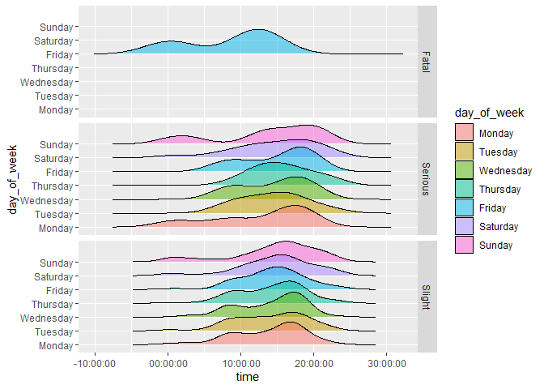

HW 03 - Road traffic accidents
================
Sarah Madison
7.13.22

## Load packages and data

``` r
library(tidyverse)
library(dsbox)
```

## Exercises

### Exercise 1

The dataset “accidents” has 768 rows.

### Exercise 2

Each row in the data set represents an individual traffic accident.

### Exercise 3

Remove this text, and add your answer for Exercise 3 here.

``` r
  accidents$day_type <- ifelse(accidents$day_of_week == "Thursday" |accidents$day_of_week == "Wednesday" |accidents$day_of_week == "Tuesday" |accidents$day_of_week == "Monday" |accidents$day_of_week == "Friday", "Weekday", "Weekend")
ggplot(accidents, aes(x = time, fill = severity)) + 
  geom_density(alpha = 0.5) + facet_grid(day_type ~.)
```

<!-- -->

### Exercise 4

Remove this text, and add your answer for Exercise 4 here.

``` r
library(ggridges)
ggplot(accidents, aes(x = time, y = day_of_week, fill = day_of_week)) + 
  geom_density_ridges(alpha = 0.5) + facet_grid(severity ~.)
```

    ## Picking joint bandwidth of 12600

    ## Picking joint bandwidth of 9170

    ## Picking joint bandwidth of 5840

<!-- -->
